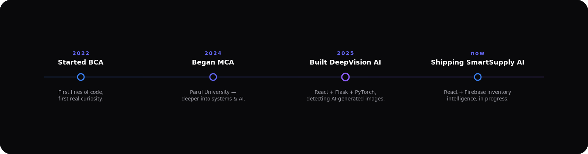
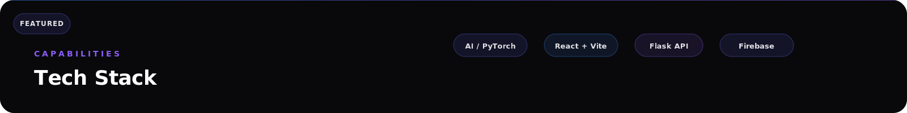
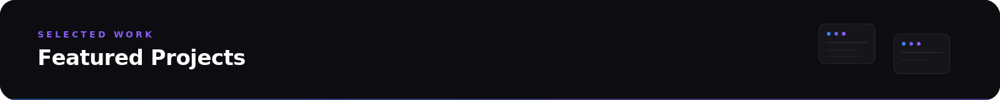

<div align="center">



<br/>

<a href="https://github.com/pcpitroda">
  
</a>

<br/>


<br/>

<a href="https://linkedin.com/in/priyanshi-pitroda"></a>
<a href="mailto:pcpitroda5@gmail.com"></a>
<a href="https://github.com/pcpitroda"></a>


</div>


<!-- ============================ ABOUT ============================ -->

<table>
<tr>
<td width="58%" valign="top">

## &nbsp; About Me

I'm **Priyanshi Pitroda** — a software developer who likes the unglamorous middle of a product: the part between the pitch and the launch, where a model has to actually run in production and a UI has to actually feel good to use.

I work across the full stack — **React** on the front, **Flask / PHP** on the back, **MySQL / Firebase** underneath — and I spend the rest of my time in **AI**, mostly **PyTorch** and computer vision, trying to make models that are not just accurate but *usable*.

Currently pursuing my **Master of Computer Applications (MCA)** at **Parul University**, where coursework meets side projects meets a slowly-growing GitHub graph.

```txt
class Priyanshi:
    def __init__(self):
        self.role   = "Software Developer · AI Enthusiast"
        self.stack  = ["React", "Flask", "PyTorch", "MySQL", "Firebase"]
        self.studying = "MCA @ Parul University"
        self.mission  = "Ship things that are both intelligent and kind to use"

    def currently(self):
        return "building SmartSupply AI, exploring deep learning architectures"
```

</td>
<td width="42%" valign="middle" align="center">


</td>
</tr>
</table>


<!-- ============================ TIMELINE ============================ -->

## &nbsp; Journey



<br/>

<table>
<tr>
<td width="50%" valign="top">

### &nbsp; Current Focus

- Deepening my understanding of **deep learning architectures** — CNNs, transfer learning, and ResNet-based pipelines
- Sharpening **full-stack fundamentals** — clean API design, state management, and database modelling
- Turning **DeepVision AI** and **SmartSupply AI** into portfolio-grade, production-shaped projects
- Reading and building alongside my MCA coursework, one commit at a time

</td>
<td width="50%" valign="top">

### &nbsp; Goals

- Contribute meaningfully to **open-source AI tooling**
- Build a signature project that pairs a trained model with a genuinely good interface
- Grow from *writing code that works* to *writing systems that scale*
- Mentor and learn in equal measure within the dev community

</td>
</tr>
</table>


<!-- ============================ TECH STACK ============================ -->



<br/>

<table align="center">
<tr>
<td align="center" valign="top" width="20%">

**Languages**

<br/><br/>


</td>
<td align="center" valign="top" width="20%">

**Frontend**

<br/><br/>


</td>
<td align="center" valign="top" width="20%">

**Backend**

<br/><br/>


</td>
<td align="center" valign="top" width="20%">

**Database**

<br/><br/>


</td>
<td align="center" valign="top" width="20%">

**AI**

<br/><br/>


</td>
</tr>
</table>

<div align="center">

**Tools**


<br/>


</div>


<!-- ============================ PROJECTS ============================ -->



<br/>

<table>
<tr>
<td width="50%" valign="top">

<h3>🧠 DeepVision AI</h3>

**AI-generated image detection**

A full-stack detection system that classifies whether an image was AI-generated or camera-captured — built end to end from model training to a usable interface.


<details>
<summary>Preview</summary>
<br/>

```
┌──────────────────────────────┐
│  DeepVision AI                │
│  ┌──────────────┐             │
│  │  [ image ]    │  → 96.4%   │
│  │               │    AI-gen  │
│  └──────────────┘             │
│  ResNet50 · Flask inference   │
└──────────────────────────────┘
```
*(screenshot placeholder — swap in a real capture)*

</details>

**Highlights**
- Transfer-learned ResNet50 backbone for binary image classification
- Flask inference API decoupled from a React client
- Designed for clarity of result, not just raw accuracy

</td>
<td width="50%" valign="top">

<h3>📦 SmartSupply AI</h3>

**Inventory management, made intelligent**

A React + Firebase inventory platform aimed at giving small operations real-time visibility into stock — built with room to grow toward predictive restocking.


<details>
<summary>Preview</summary>
<br/>

```
┌──────────────────────────────┐
│  SmartSupply AI                │
│  Stock overview                │
│  ▓▓▓▓▓▓▓▓░░  low stock (3)     │
│  ▓▓▓▓▓▓▓▓▓▓  healthy (24)      │
│  Firebase realtime sync        │
└──────────────────────────────┘
```
*(screenshot placeholder — swap in a real capture)*

</details>

**Highlights**
- Real-time Firebase sync across inventory views
- Component-driven React architecture
- Built as a foundation for future demand-forecasting features

</td>
</tr>

<tr>
<td width="50%" valign="top">

<h3>🏠 Smart Home Automation</h3>

**PHP-controlled home automation system**

A PHP and MySQL powered system for managing and automating home devices through a simple, dependable web interface.


**Highlights**
- MySQL-backed device and schedule management
- JavaScript-driven interactivity on top of a PHP core
- Focused on reliability over flash — automation that just works

</td>
<td width="50%" valign="top">

<h3>🎤 Music Artist Booking Platform</h3>

**Connecting artists with events**

A JSP-based booking platform that lets event organisers discover and book music artists, backed by a structured MySQL schema.


**Highlights**
- End-to-end booking flow from search to confirmation
- Relational schema modelling artists, events, and bookings
- Server-rendered JSP views for fast, simple delivery

</td>
</tr>
</table>

<div align="center">

<sub>More on <a href="https://github.com/pcpitroda?tab=repositories">github.com/pcpitroda</a> →</sub>

</div>


<!-- ============================ GITHUB STATS ============================ -->

## &nbsp; GitHub Analytics

<div align="center">


<br/>


</div>

<br/>

<div align="center">


</div>

<br/>

<div align="center">

**Contribution snake** — regenerated daily via GitHub Actions

<picture>
  <source media="(prefers-color-scheme: dark)" srcset="https://raw.githubusercontent.com/pcpitroda/pcpitroda/output/github-contribution-grid-snake-dark.svg" />
  
</picture>

</div>


<!-- ============================ OPEN SOURCE ============================ -->

## &nbsp; Open Source & Achievements

<table>
<tr>
<td width="50%" valign="top">

### Achievements

- Designed and shipped **4 independent full-stack / AI projects** while studying full-time
- Took a project from raw dataset to a working **ResNet50 classifier in production**
- Comfortable owning a feature from **database schema → API → interface**

</td>
<td width="50%" valign="top">

### Open Source

- Actively exploring the **open-source AI and web tooling** ecosystem
- Believe the best way to learn a codebase is to **fix something small in it first**
- Looking to make first meaningful contributions to projects in the **PyTorch / React** space

</td>
</tr>
</table>


<!-- ============================ PHILOSOPHY ============================ -->

<div align="center">


</div>

<br/>

<table align="center">
<tr>
<td align="center" width="25%">

**🎯 Precision**
<br/><sub>Ship features that do exactly what they promise.</sub>

</td>
<td align="center" width="25%">

**🧩 Clarity**
<br/><sub>Simple code beats clever code, always.</sub>

</td>
<td align="center" width="25%">

**🤖 Curiosity**
<br/><sub>Every model is a question worth asking twice.</sub>

</td>
<td align="center" width="25%">

**🌱 Growth**
<br/><sub>Learn in public, one commit at a time.</sub>

</td>
</tr>
</table>

<br/>

<table align="center">
<tr>
<td align="center" width="50%">

**Favourite Technologies**


</td>
<td align="center" width="50%">

**Fun Facts**

<sub>☕ Debugs best after chai, not coffee &nbsp;·&nbsp; 🎧 Codes better with lo-fi in the background &nbsp;·&nbsp; 📐 Sketches UI on paper before touching a keyboard</sub>

</td>
</tr>
</table>


<!-- ============================ CONTACT ============================ -->


<div align="center">

<br/>

<a href="mailto:pcpitroda05@gmail.com">
  
</a>
<a href="https://linkedin.com/in/priyanshi-pitroda">
  
</a>
<a href="https://github.com/pcpitroda">
  
</a>

</div>


<div align="center">
<sub>Thanks for reading all the way down. ⭐ this profile if you'd like to see where it goes next.</sub>
</div>
